<div align="center">

<a href="https://github.com/ThT0AltayHR/Codex-Mobile/releases/latest">
  
</a>

# Codex Mobile

### OpenAI Codex deneyimini Android telefonuna taşıyan, yerel native runtime kullanan yapay zekâlı geliştirici çalışma alanı.

<p>
  <a href="https://github.com/ThT0AltayHR/Codex-Mobile/releases/latest"></a>
  <a href="https://github.com/ThT0AltayHR/Codex-Mobile/actions/workflows/build-apk.yml"></a>
  <a href="https://github.com/ThT0AltayHR/Codex-Mobile/stargazers"></a>
  <a href="https://github.com/ThT0AltayHR/Codex-Mobile/releases"></a>
</p>

<p>
  <a href="https://github.com/ThT0AltayHR/Codex-Mobile/releases/latest"><strong>⬇️ En güncel APK'yı indir</strong></a>
  &nbsp; · &nbsp;
  <a href="https://github.com/ThT0AltayHR/Codex-Mobile/stargazers"><strong>⭐ Depoyu yıldızla</strong></a>
  &nbsp; · &nbsp;
  <a href="https://t.me/AltayHR"><strong>🐞 Hata bildir</strong></a>
</p>

</div>

> **Durum:** Codex Mobile aktif geliştirme aşamasındadır. GitHub Releases bölümündeki en üstte bulunan `stable` etiketli sürüm, o an için indirilmesi ve denenmesi önerilen güncel APK'dır; yine de geliştirme sürdüğü için bazı cihazlarda veya akışlarda hata görülebilir. Her gün hata düzeltmeleri, performans iyileştirmeleri ve yeni özellik güncellemeleri yapılır. Gerçek anlamda feature-frozen production sürümüne ulaşıldığında depoya ayrıca belirgin bir **Stable** bayrağı çekilecek ve sürüm numarası sabitlenecektir.

<div align="center">

## ✦ Bir yıldız, bir sonraki sürümü hızlandırır

Bu proje telefonundan kod yazmak, fikirlerini test etmek ve OpenAI Codex iş akışını yanında taşımak isteyen geliştiriciler için hazırlanıyor. İşine yarıyorsa [⭐ GitHub'da yıldız bırak](https://github.com/ThT0AltayHR/Codex-Mobile/stargazers). Bir yıldız; görünürlüğü, geri bildirimi ve projenin geliştirme motivasyonunu doğrudan artırır.

<a href="https://github.com/ThT0AltayHR/Codex-Mobile/stargazers">
  
</a>

</div>

---

## İçindekiler

- [Bu proje nedir?](#bu-proje-nedir)
- [Öne çıkan özellikler](#öne-çıkan-özellikler)
- [Uygulama içindeki deneyim](#uygulama-içindeki-deneyim)
- [Mimari ve teknik yaklaşım](#mimari-ve-teknik-yaklaşım)
- [Güvenlik ve veri davranışı](#güvenlik-ve-veri-davranışı)
- [Güncel APK'yı indirme](#güncel-apkyı-indirme)
- [Android'e kurulum](#androide-kurulum)
- [Kaynak koddan derleme](#kaynak-koddan-derleme)
- [Bilinen sınırlamalar](#bilinen-sınırlamalar)
- [Sorun giderme](#sorun-giderme)
- [Geliştirme yol haritası](#geliştirme-yol-haritası)
- [Katkıda bulunma](#katkıda-bulunma)
- [Hata bildirimi ve iletişim](#hata-bildirimi-ve-iletişim)
- [Lisans ve teşekkürler](#lisans-ve-teşekkürler)

---

## Bu proje nedir?

**Codex Mobile**, OpenAI Codex iş akışını masaüstünden çıkarıp Android cihazına taşımayı amaçlayan yerel bir Android uygulamasıdır. Uygulama, yalnızca bir sohbet ekranı değildir: Codex'in native ARM64 runtime'ını Android uygulamasının içine alır, her konuşmaya izole bir çalışma alanı verir, komut/derleme gibi adımların durumunu kullanıcıya gösterir ve uzun süren işleri Android foreground service üzerinden yönetir.

Telefonundan bir projeyi açıp:

- doğal dille ne yapmak istediğini anlatabilir,
- kaynak dosyaları konuşmaya ekleyebilir,
- kod yanıtlarını Markdown ve kopyalanabilir code block'lar olarak okuyabilir,
- aynı konuşmayı daha sonra thread devamlılığıyla sürdürebilir,
- GitHub hesabını bağlayabilir,
- uygulamanın hafızasını, tonunu ve kişisel talimatlarını değiştirebilir,
- Codex'in gerçek bir çalışma alanında komut çalıştırmasını izleyebilir,
- işlemi gerektiğinde durdurabilir

ve bütün bunları tek bir Android arayüzünden yönetebilirsin.

Codex Mobile'ın hedefi “telefonda küçültülmüş bir chat uygulaması” yapmak değil; **AI destekli Android developer workspace** oluşturmaktır.

---

## Öne çıkan özellikler

### 🤖 Native OpenAI Codex çalışma akışı

- OpenAI/Codex hesabıyla onboarding üzerinden giriş.
- Codex native executable'ını uygulama paketinin içinde çalıştırma.
- `codex exec --json` tabanlı yapılandırılmış event akışı.
- Aynı thread'i `codex exec resume` ile devam ettirme.
- Agent mesajı, reasoning, komut, dosya değişikliği, test, build ve tamamlanma adımlarını gerçek event'lerden ayırma.
- Uzun süren native işlemleri Android foreground service içinde yaşatma.
- Çalışan süreci durdurma ve kapanış durumunu kullanıcıya aktarma.

### 💬 Gerçek bir geliştirici sohbeti

- Modern Jetpack Compose sohbet arayüzü.
- Kullanıcı ve Codex mesajlarının kalıcı olarak saklanması.
- Konuşma başlığı değiştirme.
- Konuşmaları sabitleme.
- Konuşma geçmişinden başka bir oturuma geçme.
- Yeni konuşma başlatma.
- Silme akışında kullanıcıyı koruyan kontroller.
- Mesaj yazarken durumun ve yüklenme adımının görünür olması.
- Asistan çıktısını Markdown biçiminde okuma.
- Kod bloklarını tek dokunuşla kopyalama.
- Kaynak kartlarını açma.
- Kullanıcı seçtiği dosyayı çalışma alanına ekleme.

### 🥷 Samurai step strip

Codex çalışırken ekranın üstünde dekoratif olmayan, event tabanlı bir durum şeridi görünür:

`Düşünüyor` → `Komut çalıştırıyor` → `Dosya düzenliyor` → `Proje derliyor` → `Testleri çalıştırıyor` → `İşlemi tamamlıyor`

Bu şerit gerçek Codex event'lerinden beslenir. Uygulama rastgele bir “loading” yazısı göstermez; bildiği adımı söyler, bilmediği adımda dürüstçe genel çalışma durumuna geri döner. Aktif adımda hafif shimmer animasyonu bulunur.

### 🔐 Güvenli hesap ve gizli değer yönetimi

- OpenAI kimlik bilgilerinin uygulama içindeki yetkilendirme akışı.
- GitHub Device Flow ile GitHub bağlantısı.
- GitHub access token'ının Android `EncryptedSharedPreferences` ile saklanması.
- Secret Vault ekranında kullanıcı tanımlı gizli değerler.
- Token'ların `AGENTS.md`, prompt metni veya log içine yazılmaması.
- GitHub bağlantısını tek dokunuşla kesebilme.
- Logout sırasında uygulama state'inin gerçekten sıfırlanması.

### 🐙 GitHub bağlantısı

GitHub ekranı, Android'e uygun Device Flow kullanır:

1. Uygulama bir device code ister.
2. Kullanıcı GitHub'ın doğrulama adresini açar.
3. Kısa kodunu GitHub'a girer.
4. Uygulama yetkilendirme sonucunu güvenli depolamaya alır.
5. Codex çalışma sürecine gereken token'ı çevre değişkeni olarak aktarır.

Uygulamanın içine GitHub client secret gömülmez. Native uygulamalar için uygun olan akış kullanılır; OpenAI login ve GitHub login birbirinden ayrı tutulur.

### 🧠 Kişiselleştirme ve Memory

- Kullanıcı adı ve kısa bio.
- Dengeli, sıcak, profesyonel veya esprili konuşma tonu.
- Kullanıcının yazdığı özel talimatlar.
- Konuşma başlamadan önce güncellenen `AGENTS.md`.
- Codex'in her turda dikkate alacağı kullanıcı bağlamı.
- Konuşmaya özel izole workspace.
- Memory ekranından AGENTS içeriğini görme ve güncelleme.

### 🌍 Çok dilli onboarding

- İlk kullanımda dil seçimi.
- Dil arama.
- Uygulama tercihinin kalıcı saklanması.
- İsim ve bio adımları.
- Bio adımını atlayabilme.
- İlk kurulum tamamlandığında otomatik olarak sohbet ekranına geçiş.

### ⚙️ Ayarlar merkezi

Tek bir ayarlar ekranından:

- kişiselleştirme,
- memory,
- dil,
- storage,
- GitHub bağlantısı,
- bildirim ayarları,
- hesap durumu,
- logout

ekranlarına ulaşılır.

### 💾 Storage görünürlüğü

Uygulamanın cihazda ne kadar alan kullandığını anlamayı kolaylaştıran storage ekranı:

- Codex home,
- konuşma verileri,
- conversation workspace'leri,
- cache,
- toplam kullanım

gibi alanları kullanıcıya daha anlaşılır bir şekilde sunar.

### 📎 Dosya ve proje bağlamı

- Android document picker üzerinden dosya seçme.
- Seçilen dosyayı konuşmanın workspace'ine kopyalama.
- Konuşma bazlı çalışma alanı izolasyonu.
- Bir konuşmanın dosyalarının diğer konuşmayla karışmaması.
- Dosya yolu ve komut bağlamının Codex'e kontrollü aktarılması.

---

## Uygulama içindeki deneyim

### 1. Onboarding

İlk açılışta uygulama kullanıcıyı boş bir chat ekranına bırakmaz. Dil seçimi, OpenAI/Codex login'i, isim ve isteğe bağlı bio adımlarıyla kişisel bir başlangıç alanı oluşturulur. Daha sonra bu bilgiler Codex'e giden `AGENTS.md` içeriğinin bir parçası olarak kullanılabilir.

### 2. Chat

Chat ekranı Codex Mobile'ın merkezidir. Kullanıcı mesajını yazar, dosya ekler ve gönderir. Native Codex process'i JSON event'leri üretirken UI bunları mesajlara, sistem adımlarına ve kaynak kartlarına dönüştürür. Yeni mesaj geldiğinde kullanıcı geçmişi okuyorsa ekran zorla aşağı çekilmez; kullanıcı zaten aşağıdaysa yeni mesaja akıllı şekilde kayar.

### 3. Konuşma geçmişi

Her konuşma kendi kimliğine, başlığına, mesajlarına, sabitleme durumuna ve Codex thread id'sine sahiptir. Veriler atomik yazma yaklaşımıyla kalıcı depolamaya kaydedilir. Uygulama kapatılıp açıldığında geçmiş mümkün olduğunca kaldığı yerden devam eder.

### 4. İşlem durumu

Codex bir şey düşünürken, dosya değiştirirken veya komut çalıştırırken kullanıcı karanlık bir spinner'a mahkûm edilmez. Samurai strip gerçek event tipine göre anlaşılır bir etiket gösterir. Hata, durdurma ve başarı durumları birbirinden ayrılır.

### 5. Ayarlar ve kişisel çalışma tarzı

Kullanıcı uygulamayı kendi çalışma biçimine göre ayarlayabilir. Ton seçimi ve özel talimatlar `AGENTS.md` üzerinden her Codex turunun bağlamına taşınır. Böylece ayar yalnızca ekranda kalan bir tercih değil, modelin çalışma davranışını etkileyen bir bağlama dönüşür.

---

## Mimari ve teknik yaklaşım

| Katman | Kullanılan yaklaşım |
| --- | --- |
| Dil | Kotlin |
| UI | Jetpack Compose |
| Tema | Material 3 tabanlı özel koyu tema |
| Android | Native Android application |
| Minimum SDK | Android 8.0 / API 26 |
| Target SDK | API 35 |
| ABI | `arm64-v8a` |
| Build | Gradle + Android Gradle Plugin |
| Async | Kotlin Coroutines + Flow |
| Kalıcı tercihler | DataStore Preferences |
| Şifreli değerler | AndroidX Security Crypto |
| Ağ | OkHttp |
| Native runtime | Paket içindeki ARM64 Codex executable |
| CI | GitHub Actions |
| Büyük dosya | Git LFS |

### Native runtime neden ayrı?

Codex binary'si normal bir JNI kütüphanesi gibi `dlopen` edilmez. Uygulama, binary'yi Android'in native library alanından gerçek bir child process olarak başlatır. Bu yaklaşım:

- CLI davranışına daha yakın kalır,
- stdout ve stderr akışlarını ayrı izlemeyi sağlar,
- JSON event'lerini satır satır almayı mümkün kılar,
- bir turu timeout ile sınırlamayı,
- devam eden process'i durdurmayı,
- `CODEX_HOME`, `HOME`, `TMPDIR` ve `LD_LIBRARY_PATH` gibi ortam değişkenlerini kontrollü vermeyi

kolaylaştırır.

### Conversation-scoped workspace

Her konuşma için:

```text
files/
└── codex_workspace/
    └── conversations/
        ├── conversation_1/
        ├── conversation_2/
        └── conversation_3/
```

gibi izole bir çalışma alanı kullanılır. Konuşma kimliği dosya yolu için güvenli bir ada dönüştürülür. Böylece farklı projelerin dosyaları aynı klasörde birbirine karışmaz.

### Foreground service

Android, Activity yaşam döngüsü dışındaki uzun işlerde süreci sonlandırabilir. Codex Mobile bu nedenle Codex process'ini `CodexProcessService` üzerinden çalıştırır. Activity servise bağlanır, servisin gerçek runtime'ını ViewModel'e aktarır ve kullanıcı uygulamayı arka plana alsa bile Android kuralları içinde işi sürdürmeye çalışır.

### Event parser

`ThreadEvent` parser'ı Codex event şemasındaki:

- `thread.started`,
- `turn.started`,
- `turn.completed`,
- `turn.failed`,
- `item.started`,
- `item.updated`,
- `item.completed`

olaylarını ayrıştırır. Agent message, reasoning, command execution ve file change içerikleri gerçek JSON alanlarından okunur. Bilinmeyen event türleri kontrollü biçimde `Unknown` olarak tutulur.

---

## Güvenlik ve veri davranışı

Bu proje kişisel hesaplar, token'lar ve kullanıcı dosyalarıyla çalıştığı için aşağıdaki prensipler önemlidir:

- GitHub access token'ı şifreli Android preferences içinde tutulur.
- Token'lar prompt'a, `AGENTS.md` dosyasına veya kullanıcı arayüzündeki normal metne yazılmaz.
- OpenAI ve GitHub girişleri ayrı yöneticiler üzerinden yürütülür.
- Conversation workspace'leri birbirinden ayrılır.
- Logout sırasında OpenAI, GitHub ve onboarding state'leri temizlenir.
- Uygulama yalnızca desteklenen Android ABI'sini paketler.
- Native process ortam değişkenleri kontrollü biçimde oluşturulur.
- Dosya seçimi Android document picker ile kullanıcı onayına bağlıdır.

> Bu proje bir güvenlik ürünü veya kurumsal compliance sertifikası değildir. APK'yı yalnızca güvendiğin kaynaklardan indir, uygulama izinlerini kontrol et ve hassas production token'larını test sürümlerinde kullanmadan önce riskleri değerlendir.

---

## Güncel APK'yı indirme

### Önerilen yol

Her zaman [GitHub Releases sayfasındaki en güncel sürümü](https://github.com/ThT0AltayHR/Codex-Mobile/releases/latest) indir. Üstteki `stable` etiketli sürüm, geliştirme devam ederken o an için kullanılabilir ve önerilen APK snapshot'ıdır.

<div align="center">

<a href="https://github.com/ThT0AltayHR/Codex-Mobile/releases/latest">
  
</a>

<a href="https://github.com/ThT0AltayHR/Codex-Mobile/releases">
  
</a>

</div>

### Release politikası

- Her başarılı CI build'inde APK artifact'i oluşur.
- Kullanılabilir olduğu doğrulanan sürüm Releases bölümünde görünür.
- Geliştirme aşamasındaki sürümlerde yeni özellikler ve düzeltmeler birlikte bulunabilir.
- Bir APK'nın “stable” etiketli olması, bu projenin artık geliştirilmediği anlamına gelmez.
- Büyük kararlı sürüm kilometre taşında ayrıca belirgin bir `Stable` bayrağı, sürüm notu ve sabit sürüm işareti yayınlanacaktır.
- Hata bulursan önce [Issues](https://github.com/ThT0AltayHR/Codex-Mobile/issues) veya [Telegram üzerinden AltayHR](https://t.me/AltayHR) ile bildir.

---

## Android'e kurulum

### Telefon üzerinden

1. [Releases](https://github.com/ThT0AltayHR/Codex-Mobile/releases/latest) sayfasını aç.
2. En üstteki `CODEX-MOBILE-STABLE.apk` veya güncel APK asset'ini indir.
3. Android sorarsa kullandığın tarayıcıya “bilinmeyen uygulama yükleme” izni ver.
4. APK'yı aç ve kurulumu tamamla.
5. Uygulamayı açıp onboarding adımlarını takip et.

### ADB ile

```bash
adb install -r CODEX-MOBILE-STABLE.apk
```

Mevcut uygulama imzası farklıysa Android güncelleme yerine yeni kurulum isteyebilir. Böyle bir durumda eski uygulamayı kaldırmadan önce cihazdaki yerel konuşma ve preference verilerinin silinebileceğini hesaba kat.

### Cihaz gereksinimleri

- Android 8.0 veya üzeri.
- ARM64 cihaz (`arm64-v8a`).
- Codex runtime için yeterli boş alan.
- Login ve GitHub bağlantısı için internet.
- Native process ve büyük model çıktıları için makul RAM.

> Çok eski, 32-bit-only veya ARM64 desteği olmayan cihazlarda bu APK çalışmayabilir.

---

## Kaynak koddan derleme

### Gereksinimler

- JDK 17
- Android SDK Platform 35
- Android SDK Build Tools
- Git
- Git LFS
- ARM64 Android cihaz veya emulator

### Klonlama

```bash
git clone https://github.com/ThT0AltayHR/Codex-Mobile.git
cd Codex-Mobile
git lfs install
git lfs pull
```

### Debug APK

```bash
chmod +x gradlew
./gradlew assembleDebug
```

APK çıktısı:

```text
app/build/outputs/apk/debug/app-debug.apk
```

### Release build

Bu depodaki GitHub Actions workflow'u her push'ta native binary kontrolü yapar, Gradle wrapper'ı hazırlar ve APK üretir. Büyük `libcodexcore.so` dosyası Git LFS ile tutulur; LFS olmadan eksik pointer dosyasıyla build başlatma.

```bash
./gradlew clean
./gradlew assembleDebug --stacktrace
```

### CI akışı

```text
Checkout
   ↓
Git LFS pull
   ↓
JDK 17 + Android SDK
   ↓
Gradle wrapper bootstrap
   ↓
Native binary boyut doğrulaması
   ↓
assembleDebug
   ↓
GitHub Actions artifact
```

---

## Bilinen sınırlamalar

- Şu an yalnızca `arm64-v8a` native runtime paketlenir.
- APK aktif geliştirme snapshot'ıdır; bazı ekranlar veya cihaz kombinasyonları beklenmeyen davranabilir.
- Native binary büyük olduğu için clone ve CI işlemleri normal Android projelerinden daha uzun sürebilir.
- GitHub Device Flow için internet bağlantısı gerekir.
- Uygulama bir desktop IDE değildir; Android'in dosya, process, arka plan ve izin kurallarına tabidir.
- Bazı Codex özellikleri kullanılan native binary sürümüne bağlıdır.
- Debug artifact, dağıtım sertifikasıyla imzalanmış bir Play Store paketi değildir.
- Google Play yayınlama, cihaz uyumluluğu ve üretim imzalama ayrı süreçlerdir.

Bu sınırlamalar gizlenmez. Amaç, kullanıcıların hangi noktada test yaptığını bilmesini ve hata bildirimlerinin daha işe yarar olmasını sağlamaktır.

---

## Sorun giderme

### APK kuruluyor ama uygulama açılmıyor

1. Cihazın ARM64 olup olmadığını kontrol et.
2. Eski farklı imzalı sürümü kaldırıp tekrar kur.
3. Android sürümünün API 26 veya üzeri olduğundan emin ol.
4. Hata ekranı veya Logcat çıktısıyla issue aç.

### Login tamamlanmıyor

1. İnternet bağlantısını kontrol et.
2. Sistem tarayıcısında login akışını tamamla.
3. Uygulamayı kapatıp aç.
4. Hangi adımda kaldığını ve cihaz modelini Telegram'da bildir.

### GitHub bağlantısı bekliyor

Device Flow birkaç saniye bekleyebilir. Kodu süresi dolmadan GitHub doğrulama sayfasına gir. Daha önce bağlandıysan Settings → GitHub ekranından bağlantıyı kesip yeniden bağlan.

### Codex process başlamıyor

- Native binary'nin APK'da bulunduğundan emin ol.
- Cihaz ABI'sini kontrol et.
- Storage'da yeterli alan bırak.
- Uygulama logundaki ilk gerçek hata satırını sakla; yalnızca “çalışmadı” demek yerine onu paylaş.

### Build `libcodexcore.so` hatası veriyor

```bash
git lfs install
git lfs pull
git lfs ls-files
```

Dosya bir LFS pointer'ı olarak kalıyorsa gerçek binary indirilmemiştir. `git lfs ls-files` çıktısında native dosyanın görünmesi gerekir.

### Hata bildirirken şunları ekle

- Telefon modeli.
- Android sürümü.
- APK sürüm/tag'i.
- Hatanın tekrarlanma adımları.
- Beklenen davranış.
- Gerçek davranış.
- Varsa ekran görüntüsü veya Logcat'in ilgili kısmı.
- Token, şifre veya kişisel dosya içeriği **ekleme**.

---

## Geliştirme yol haritası

### Şu an odaklanılanlar

- Build kararlılığını artırmak.
- Native process yaşam döngüsünü daha sağlam yönetmek.
- Android cihaz çeşitliliğinde login ve foreground service testlerini artırmak.
- Conversation resume ve workspace izolasyonunu geliştirmek.
- Hata mesajlarını daha anlaşılır hale getirmek.

### Sonraki aşamalar

- Daha fazla Android ABI desteği için araştırma.
- Release imzalama ve sürümleme akışını production seviyesine taşımak.
- Daha iyi offline/queued action deneyimi.
- Daha kapsamlı proje dosyası önizlemeleri.
- Daha ayrıntılı build/test sonuçları.
- Kullanıcı geri bildirimlerinden beslenen yeni kişiselleştirme seçenekleri.
- Kararlı sürüm kilometre taşında sabit `Stable` bayrağı.

### Bir sonraki sürüme yardım et

Bir yıldız bırakmak, gerçek cihazında denemek, tekrar üretilebilir bir bug bildirmek ve küçük bir dokümantasyon düzeltmesi göndermek projenin görünürlüğünü doğrudan artırır.

---

## Katkıda bulunma

1. Depoyu fork'la.
2. Kendi branch'ini aç:

   ```bash
   git checkout -b fix/your-improvement
   ```

3. Değişikliğini küçük ve açıklanabilir tut.
4. Build'i çalıştır:

   ```bash
   ./gradlew assembleDebug
   ```

5. Commit mesajında neyi neden değiştirdiğini yaz.
6. Pull request aç ve cihaz/build bilgilerini ekle.

Kod katkılarında özellikle şu alanlar değerlidir:

- Kotlin/Compose UI iyileştirmeleri.
- Android lifecycle ve service davranışı.
- Codex event parser testleri.
- Conversation persistence.
- GitHub Device Flow hata yönetimi.
- Türkçe ve İngilizce dokümantasyon.
- Gerçek Android cihaz testleri.

---

## Hata bildirimi ve iletişim

### 🐞 Telegram widget

Hata, fikir veya cihaz uyumluluğu geri bildirimi için:

<div align="center">

<a href="https://t.me/AltayHR">
  
</a>

</div>

Mesajında mümkünse `Codex Mobile`, sürüm/tag, telefon modeli ve hatanın tekrar adımlarını belirt. Şifre, access token, private key veya kişisel dosya gönderme.

### GitHub Issues

Tekrarlanabilir teknik hatalar için [GitHub Issues](https://github.com/ThT0AltayHR/Codex-Mobile/issues) daha iyi yerdir. Issue açarken başlığı kısa, gövdeyi teknik ve adım adım yaz.

---

## Lisans ve teşekkürler

Bu proje Apache License 2.0 lisansı altında dağıtılır. Ayrıntılar için [`LICENSE`](LICENSE) dosyasına bak.

Codex Mobile; Android, Kotlin, Jetpack Compose, OkHttp, Kotlin Coroutines, DataStore ve GitHub Actions ekosisteminden yararlanır. Bu projeyi geliştirirken kullanılan upstream/native bileşenlerin kendi lisans ve bildirimlerini de kontrol et.

---

<div align="center">

## Telefonundan fikirden çalışan koda

<a href="https://github.com/ThT0AltayHR/Codex-Mobile/releases/latest">
  
</a>
<a href="https://github.com/ThT0AltayHR/Codex-Mobile/stargazers">
  
</a>
<a href="https://t.me/AltayHR">
  
</a>

<br><br>

**OpenAI Codex · CLI · Android · Android Studio · AI Developer · Kotlin · Jetpack Compose**

</div>